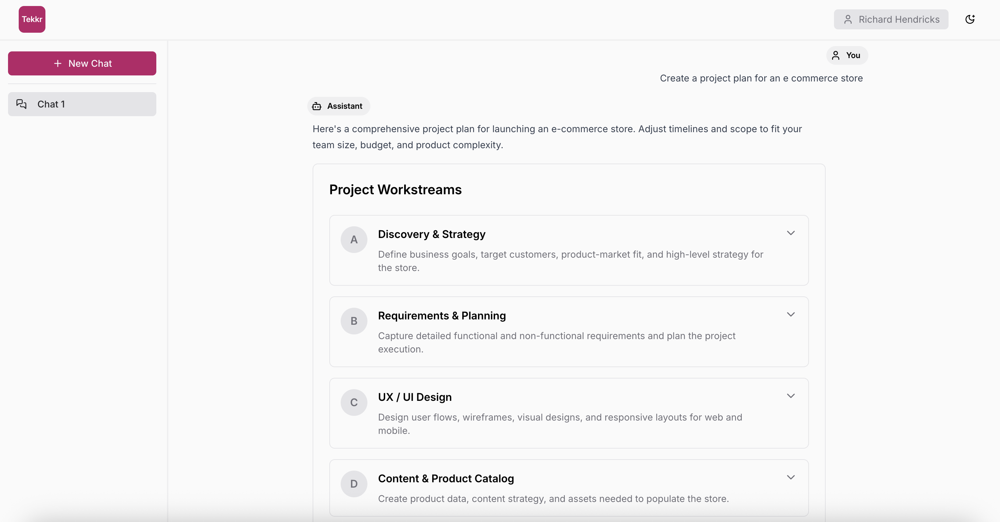
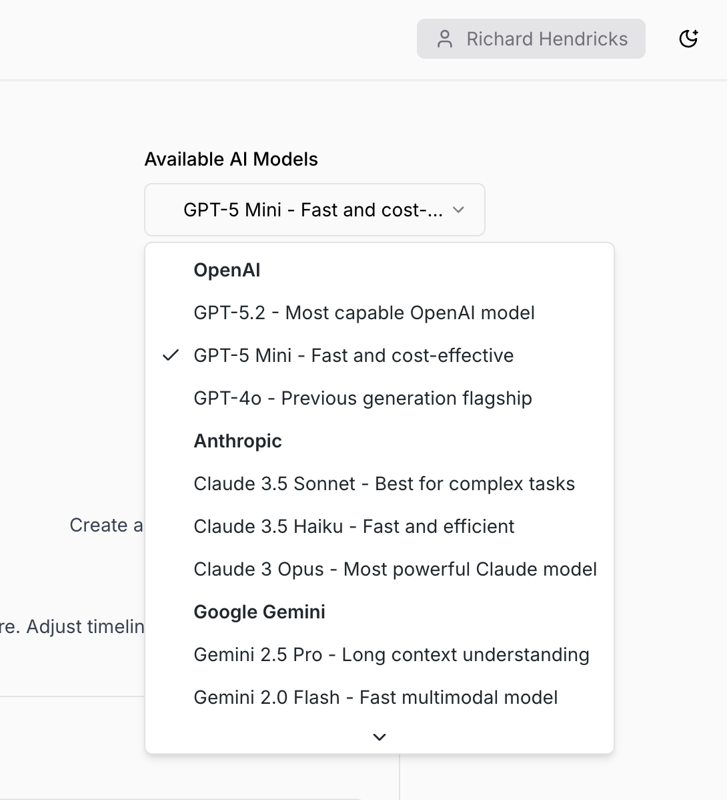

# Workstream AI Assistant

## 📸 Screenshots

### Project Plan Preview
Structured project plans are rendered with collapsible workstreams and deliverables for easy visualization.



### AI Model Selector
The application features a dynamic model selector that allows switching between different AI providers and models mid-conversation.





## Overview

This project is a full-stack multi-LLM chat application that allows users to interact with multiple AI providers (OpenAI, Anthropic, and Google Gemini) through a unified interface. Users can create multiple chats, switch between them, change AI models mid-conversation, and receive structured project plans with expandable/collapsible sections.

## ✨ Implemented Features

### Core Features
- ✅ **Multi-LLM Support**: Seamlessly switch between OpenAI, Anthropic, and Google Gemini models
- ✅ **Chat Management**: Create new chats, switch between conversations, persistent chat history
- ✅ **Dynamic Model Selection**: Change AI models mid-conversation with a visual selector
- ✅ **Project Plan Previews**: Inline expandable/collapsible project plan visualizations
- ✅ **Optimistic UI Updates**: Messages appear instantly before server response
- ✅ **Markdown Rendering**: Full markdown support with syntax highlighting
- ✅ **Auto-scroll**: Automatic scrolling to latest messages
- ✅ **Loading Indicators**: Visual feedback during LLM processing
- ✅ **State Persistence**: Chat selection and model preference preserved across page reloads

### Architecture Highlights
- **Provider Abstraction**: Interface-based LLM provider design with factory pattern
- **React Query**: Advanced state management with optimistic updates and caching
- **In-Memory Storage**: Fast chat persistence using JavaScript Map
- **Type Safety**: Full TypeScript implementation across frontend and backend

## 🚀 Quick Start

### Prerequisites
- Node.js 16+ and npm
- API keys for at least one LLM provider (OpenAI, Anthropic, or Google Gemini)

### Installation

1. Clone this repository
```bash
git clone <repository-url>
cd hiring-test-full-stack
```

2. Install dependencies in both directories
```bash
# Install backend dependencies
cd server
npm install

# Install frontend dependencies
cd ../web
npm install
```

3. Set up environment variables

Create a `.env` file in the `server` directory with your API keys:

```bash
# At least one API key is required
OPENAI_API_KEY=your_openai_api_key_here
ANTHROPIC_API_KEY=your_anthropic_api_key_here
GEMINI_API_KEY=your_gemini_api_key_here
```

4. Start both servers

```bash
# Start backend (from server directory)
cd server
npm start
# Backend runs on http://localhost:8000

# Start frontend (from web directory)
cd web
npm start
# Frontend runs on http://localhost:3000
```

5. Open your browser and navigate to `http://localhost:3000`

## 📁 Project Structure

### Backend (`/server`)

```
server/
├── src/
│   ├── domain/
│   │   └── chat.ts                    # Chat domain models and types
│   ├── routes/
│   │   └── chats/
│   │       └── index.ts               # Chat REST API endpoints
│   ├── services/
│   │   ├── chat-storage.ts            # In-memory chat storage service
│   │   ├── system-prompts.ts          # LLM system prompt configurations
│   │   └── llm/
│   │       ├── types.ts               # LLM provider interface
│   │       ├── factory.ts             # Provider factory pattern
│   │       ├── openai-provider.ts     # OpenAI implementation
│   │       ├── anthropic-provider.ts  # Anthropic Claude implementation
│   │       └── gemini-provider.ts     # Google Gemini implementation
│   └── app.ts                         # Fastify app configuration
```

### Frontend (`/web`)

```
web/
├── src/
│   ├── components/
│   │   ├── chat-input-box.tsx         # Message input component
│   │   ├── chat-sidebar.tsx           # Chat list sidebar
│   │   ├── message-content.tsx        # Mixed content renderer
│   │   ├── model-selector.tsx         # AI model dropdown selector
│   │   └── project-plan-preview.tsx   # Collapsible project plan UI
│   ├── data/
│   │   ├── api/
│   │   │   └── chats.ts               # API client functions
│   │   └── queries/
│   │       └── chats.ts               # React Query hooks
│   ├── pages/
│   │   └── home-page.tsx              # Main application page
│   ├── types/
│   │   ├── chat.ts                    # Chat type definitions
│   │   ├── models.ts                  # Model configurations
│   │   └── project-plan.ts            # Project plan types
│   └── utils/
│       └── project-plan-parser.ts     # Parser for <PROJECT_PLAN> tags
```

## 🛠️ Technology Stack

### Backend
- **Fastify** - Fast and low overhead web framework
- **TypeScript** - Type-safe JavaScript
- **dotenv** - Environment variable management
- **In-Memory Storage** - JavaScript Map for chat persistence

### Frontend
- **React 18** - UI library with hooks
- **TypeScript** - Type-safe development
- **TanStack React Query** - Server state management with caching and optimistic updates
- **Axios** - HTTP client for API requests
- **Tailwind CSS** - Utility-first CSS framework
- **shadcn/ui** - High-quality React components built on Radix UI
- **react-markdown** - Markdown rendering with remark-gfm for enhanced formatting
- **Radix UI** - Unstyled, accessible component primitives

### LLM Providers
- **OpenAI API** - GPT models (GPT-5.2, GPT-5 Mini, GPT-4o)
- **Anthropic API** - Claude models (Claude 3.5 Sonnet, Claude 3.5 Haiku, Claude 3 Opus)
- **Google Gemini API** - Gemini models (Gemini 2.5 Pro, Gemini 2.5 Flash, Gemini 1.5 Flash)

## 🏗️ Architecture & Design Decisions

### LLM Provider Abstraction

The application uses an **interface-based design with factory pattern** to support multiple LLM providers:

```typescript
// Core interface that all providers implement
interface LLMProvider {
  generateCompletion(messages: Message[]): Promise<LLMResponse>;
  getProviderName(): string;
  getModelName(): string;
}

// Factory creates the appropriate provider instance
LLMFactory.createProvider(providerType, apiKey, model);
```

**Benefits:**
- Easy to add new providers - just implement the interface
- Swappable at runtime - users can change models mid-conversation
- Testable - can mock providers for testing
- Clean separation of concerns

### React Query for State Management

The frontend uses **TanStack React Query** for all server interactions:

**Key Features:**
- **Automatic Caching**: Fetched data is cached and reused across components
- **Optimistic Updates**: UI updates immediately before API response
- **Auto-Refetching**: Keeps data fresh with background updates
- **Error Handling**: Built-in retry logic and error states
- **Loading States**: Automatic loading indicators

**Example - Optimistic Message Sending:**
```typescript
useSendMessageMutation({
  // 1. Immediately show user message in UI
  onMutate: async (request) => {
    queryClient.setQueryData(chatKeys.detail(chatId), (old) => ({
      ...old,
      messages: [...old.messages, { role: 'user', content: request.content }]
    }));
  },

  // 2. Update with real server response
  onSuccess: (response) => {
    queryClient.setQueryData(chatKeys.detail(chatId), response.chat);
  },

  // 3. Rollback on error
  onError: (err, variables, context) => {
    queryClient.setQueryData(chatKeys.detail(chatId), context.previousChat);
  }
});
```

### Storage Strategy

**Backend (In-Memory):**
- Uses JavaScript `Map<string, Chat>` for fast lookups
- Data persists during server runtime
- Resets when server restarts (acceptable for MVP)

**Frontend (localStorage):**
- Stores UI preferences only (selected chat ID, selected model ID)
- Persists across page reloads
- Does not store chat messages (retrieved from backend)

### Project Plan Detection

When users request project plans, the LLM is instructed via system prompt to wrap structured data in `<PROJECT_PLAN>` tags:

```typescript
// LLM response format
"Here's your plan:

<PROJECT_PLAN>
{
  "workstreams": [
    {
      "id": "A",
      "title": "Frontend Development",
      "description": "Build user interface",
      "deliverables": [...]
    }
  ]
}
</PROJECT_PLAN>

The plan includes..."
```

The parser extracts these blocks and renders them as interactive components.

## 📡 API Endpoints

### Base URL: `http://localhost:8000`

#### GET `/chats`
List all chat summaries
```json
Response: [
  {
    "id": "uuid",
    "name": "Chat 1",
    "createdAt": "2025-01-01T00:00:00.000Z",
    "updatedAt": "2025-01-01T00:05:00.000Z"
  }
]
```

#### POST `/chats`
Create a new chat
```json
Request: {
  "name": "My Chat",
  "provider": "openai",  // optional
  "model": "gpt-5.2"     // optional
}

Response: {
  "id": "uuid",
  "name": "My Chat",
  "messages": [],
  "createdAt": "2025-01-01T00:00:00.000Z",
  "updatedAt": "2025-01-01T00:00:00.000Z",
  "provider": "openai",
  "model": "gpt-5.2"
}
```

#### GET `/chats/:id`
Get a specific chat with all messages
```json
Response: {
  "id": "uuid",
  "name": "My Chat",
  "messages": [
    {
      "id": "msg-uuid",
      "role": "user",
      "content": "Hello!",
      "timestamp": "2025-01-01T00:00:00.000Z"
    },
    {
      "id": "msg-uuid-2",
      "role": "assistant",
      "content": "Hi! How can I help?",
      "timestamp": "2025-01-01T00:00:01.000Z"
    }
  ],
  "provider": "openai",
  "model": "gpt-5.2",
  "createdAt": "2025-01-01T00:00:00.000Z",
  "updatedAt": "2025-01-01T00:01:00.000Z"
}
```

#### POST `/chats/:id/messages`
Send a message and get LLM response
```json
Request: {
  "content": "Create a project plan for a web app",
  "model": "claude-3-5-sonnet-20241022",  // optional - overrides chat's model
  "provider": "anthropic"                  // optional - overrides chat's provider
}

Response: {
  "userMessage": { /* user message object */ },
  "assistantMessage": { /* LLM response message object */ },
  "chat": { /* updated chat object with all messages */ }
}
```

#### DELETE `/chats/:id`
Delete a chat
```json
Response: {
  "success": true
}
```

#### PATCH `/chats/:id`
Update chat name
```json
Request: {
  "name": "New Chat Name"
}

Response: {
  "id": "uuid",
  "name": "New Chat Name",
  // ... rest of chat object
}
```

## 🎯 Available AI Models

The application supports 9 different AI models across 3 providers:

### OpenAI Models
- **GPT-5.2** - Most capable OpenAI model
- **GPT-5 Mini** - Fast and cost-effective
- **GPT-4o** - Previous generation flagship

### Anthropic Models
- **Claude 3.5 Sonnet** - Best for complex tasks
- **Claude 3.5 Haiku** - Fast and efficient
- **Claude 3 Opus** - Most powerful Claude model

### Google Gemini Models
- **Gemini 2.5 Pro** - Long context understanding
- **Gemini 2.5 Flash** - Fast multimodal model
- **Gemini 1.5 Flash** - Fast and efficient

Users can switch between any model at any time during a conversation using the model selector in the top-right corner.

## 🔄 How It Works

### Creating and Sending Messages

1. **User creates a new chat** → Frontend calls `POST /chats` → Backend creates chat in Map → Returns chat object
2. **Frontend receives chat** → React Query caches it → Updates UI optimistically
3. **User types message** → Clicks send → Frontend immediately shows message (optimistic update)
4. **Frontend calls `POST /chats/:id/messages`** → Includes selected model and provider
5. **Backend receives message** → Creates LLM provider instance → Sends to appropriate API
6. **LLM responds** → Backend stores both messages → Returns response
7. **Frontend receives response** → React Query updates cache → UI shows assistant message

### Model Switching Flow

1. **User selects different model** → Saved to localStorage
2. **Next message sent** → Includes new model ID and provider in request body
3. **Backend checks request** → Uses provided model/provider instead of chat's default
4. **Backend updates chat** → Stores new model/provider for future reference

### Project Plan Rendering

1. **User asks for project plan** → LLM receives system prompt with formatting instructions
2. **LLM responds with `<PROJECT_PLAN>` tags** → Contains JSON with workstreams and deliverables
3. **Frontend parser** → Extracts plan blocks using regex → Separates text from plan data
4. **MessageContent component** → Renders text parts as markdown → Renders plan parts as ProjectPlanPreview
5. **ProjectPlanPreview** → Uses Radix UI Collapsible → Shows expandable sections

## 🎨 UI/UX Features

- **Responsive Design**: Clean, modern interface with Tailwind CSS
- **Auto-scroll**: Automatically scrolls to newest message
- **Loading States**: Skeleton loaders and disabled states during API calls
- **Error Handling**: Graceful error messages with retry capability
- **Markdown Support**: Rich text formatting including code blocks, lists, and links
- **Keyboard Support**: Press Enter to send messages
- **Visual Feedback**: Active chat highlighting, hover states, transitions

## 🧪 Testing the App

### Test Chat Functionality
1. Create a new chat using the "New Chat" button
2. Send a message like "Hello, how are you?"
3. Watch the optimistic update (message appears instantly)
4. See the loading indicator while waiting for LLM
5. View the AI response with markdown formatting

### Test Project Plans
Send a message like:
```
Create a project plan for building a todo app with React and Node.js
```

The LLM should respond with an inline project plan preview showing collapsible workstreams.

### Test Model Switching
1. Start a chat with default model (GPT-5.2)
2. Send a message
3. Switch to Claude 3.5 Sonnet using the model selector
4. Send another message
5. Notice the different response style

### Test Persistence
1. Create multiple chats
2. Send messages in different chats
3. Refresh the page
4. Verify all chats and messages are still available
5. Verify the same chat is selected as before refresh

---
